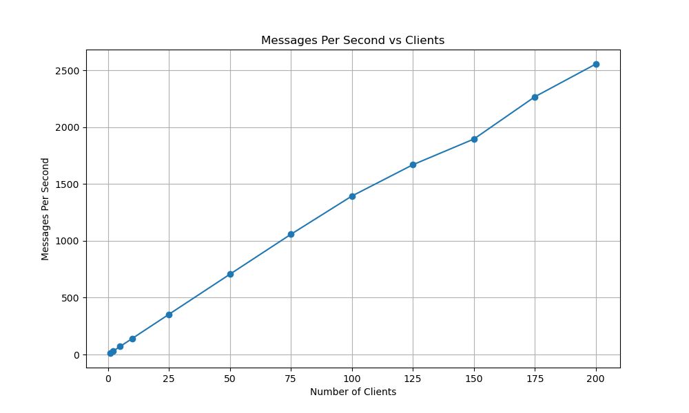
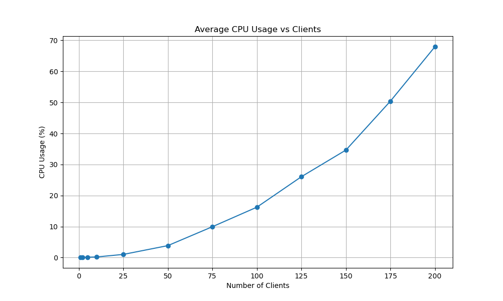
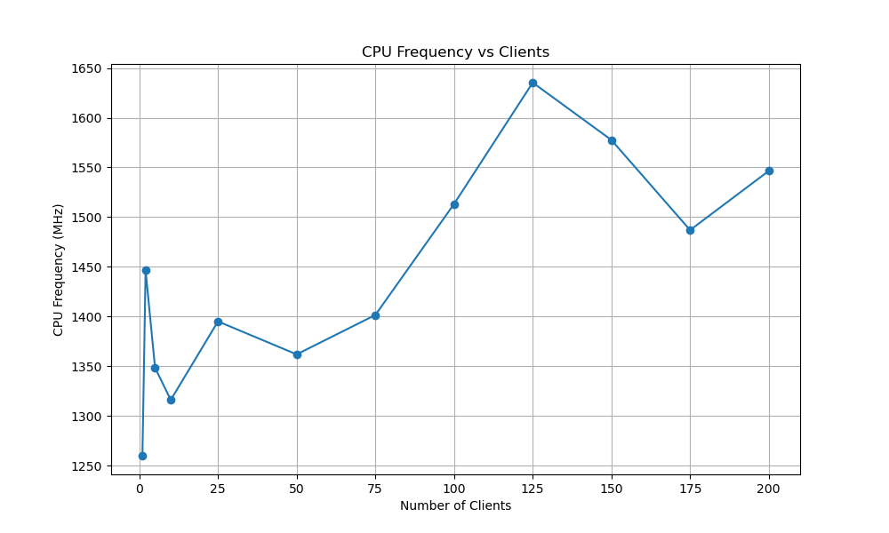
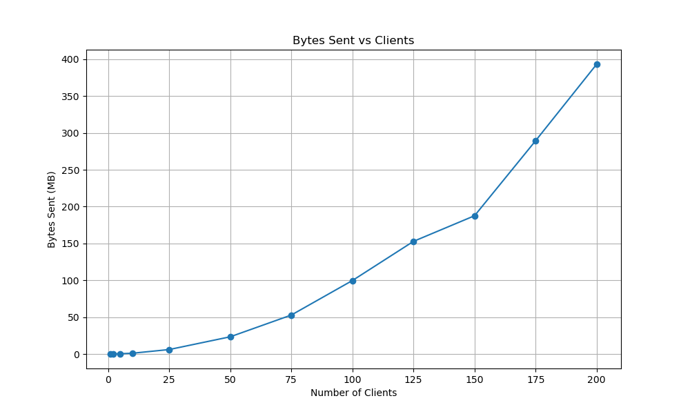
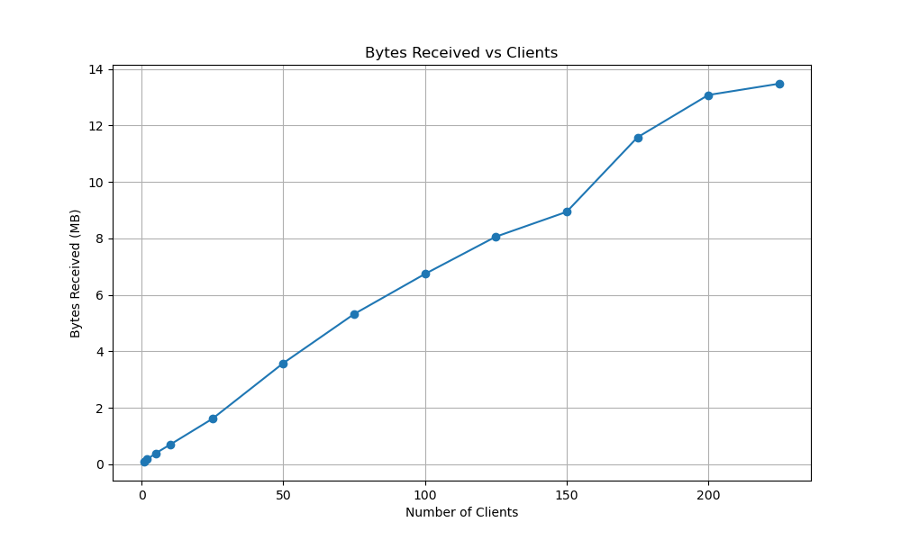
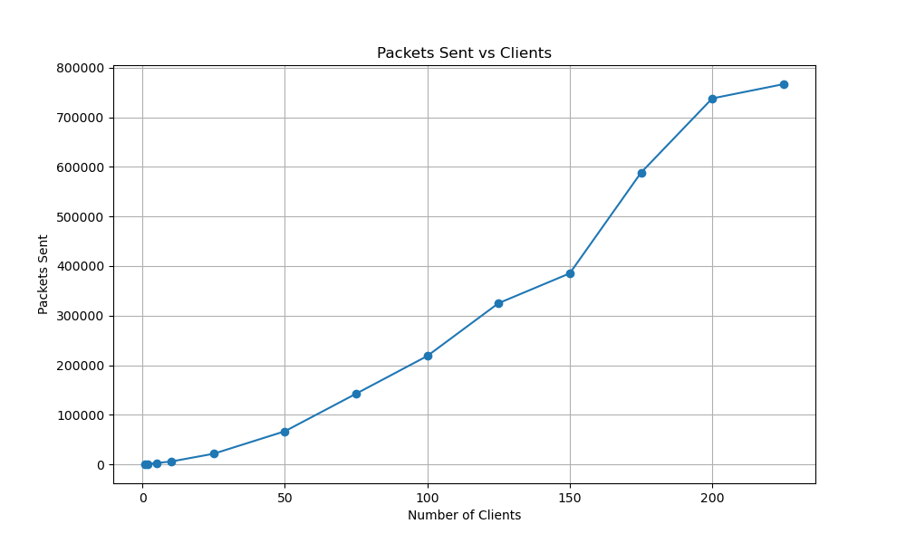
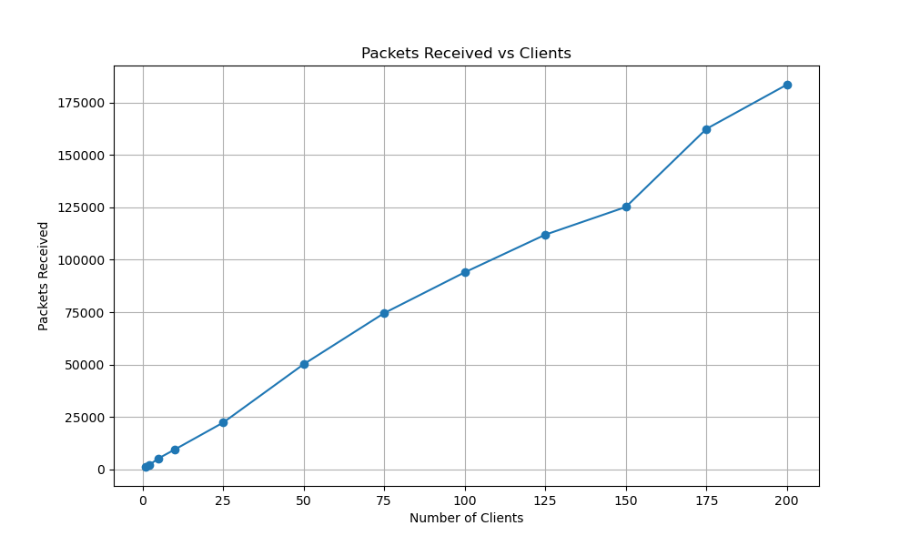
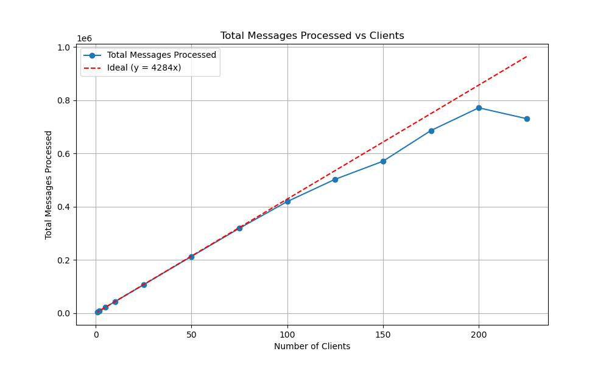

# Part 2 Analysis

## Introduction

In this analysis, we evaluate the performance of our chat server by measuring how it handles an increasing number of clients. The goal is to understand how the server scales and identify any performance bottlenecks as the client load increases.

## Experimental Setup

- **Server**: The chat server runs on a dedicated machine separate from the clients.
- **Clients**: A test client sends messages as fast as possible while also listening for incoming messages.
- **Number of Clients**: We conducted experiments with varying numbers of clients: 1, 2, 5, 10, 25, 50, 75, 100, 125, 150, 175, and 200.
- **Duration**: Each experiment ran for approximately 5 minutes (~300 seconds).
- **Metrics Collected**:
  - Total messages processed
  - Total elapsed time
  - Average messages per second
  - Average CPU usage
  - Average memory usage
  - Average bytes sent and received per interval
  - Average packets sent and received per interval
  - Average CPU frequency

## Results

### Summary of Data

| Clients | Total Messages Processed | Elapsed Time (s) | Avg Messages/sec | Avg CPU Usage (%) | Avg Memory Usage (MB) | Avg Bytes Sent per Interval (MB) | Avg Bytes Received per Interval (MB) | Avg Packets Sent per Interval | Avg Packets Received per Interval | Avg CPU Frequency (MHz) |
| ------- | ------------------------ | ---------------- | ---------------- | ----------------- | --------------------- | -------------------------------- | ------------------------------------ | ----------------------------- | --------------------------------- | ----------------------- |
| 1       | 3,721                    | 300.65           | 12.38            | 0.08              | 12.75                 | 0.02                             | 0.09                                 | 264.57                        | 1,232.43                          | 1,259.85                |
| 2       | 8,536                    | 300.90           | 28.37            | 0.10              | 12.99                 | 0.06                             | 0.17                                 | 594.80                        | 2,062.67                          | 1,446.53                |
| 5       | 21,320                   | 300.80           | 70.88            | 0.14              | 12.87                 | 0.34                             | 0.39                                 | 2,870.00                      | 5,312.53                          | 1,348.48                |
| 10      | 42,600                   | 300.72           | 141.66           | 0.21              | 12.62                 | 1.06                             | 0.69                                 | 5,726.00                      | 9,506.79                          | 1,315.99                |
| 25      | 106,375                  | 300.59           | 353.89           | 1.03              | 12.75                 | 6.03                             | 1.61                                 | 21,445.60                     | 22,329.13                         | 1,395.03                |
| 50      | 212,880                  | 301.26           | 706.64           | 3.86              | 12.75                 | 23.35                            | 3.58                                 | 66,773.80                     | 50,173.20                         | 1,361.85                |
| 75      | 318,591                  | 301.19           | 1,057.78         | 9.95              | 12.75                 | 52.85                            | 5.32                                 | 142,494.93                    | 74,580.00                         | 1,401.47                |
| 100     | 419,027                  | 300.49           | 1,394.48         | 16.25             | 12.62                 | 99.68                            | 6.74                                 | 218,646.47                    | 94,029.47                         | 1,513.21                |
| 125     | 502,758                  | 301.06           | 1,669.95         | 26.07             | 12.73                 | 152.83                           | 8.06                                 | 325,119.07                    | 111,979.67                        | 1,635.37                |
| 150     | 570,540                  | 301.26           | 1,895.90         | 34.66             | 12.87                 | 187.61                           | 8.94                                 | 385,319.07                    | 125,192.93                        | 1,577.62                |
| 175     | 685,847                  | 302.40           | 2,267.98         | 50.43             | 12.62                 | 289.43                           | 11.58                                | 588,347.87                    | 162,445.27                        | 1,486.96                |
| 200     | 771,403                  | 301.79           | 2,556.11         | 67.97             | 12.62                 | 393.30                           | 13.08                                | 738,123.93                    | 183,558.87                        | 1,546.51                |

### Graphs

#### Average Messages per Second vs. Number of Clients

#### Average CPU Usage vs. Number of Clients

#### Average CPU Frequency vs. Number of Clients

#### Bytes Sent per Interval vs. Number of Clients

#### Bytes Received per Interval vs. Number of Clients

#### Packets Sent per Interval vs. Number of Clients

#### Packets Received per Interval vs. Number of Clients

#### Total Messages Processed vs. Number of Clients | with ideal performance

## Analysis

### Did running more clients affect the performance of your server?

Yes, running more clients significantly affected the server's performance. As the number of clients increased:

- **Average Messages per Second**: The server shows a steady increase in the number of messages processed per second as the number of clients grows, but this increase slows down as the client count rises. Notably, doubling the clients from 100 to 200 does not result in a proportional doubling of the messages per second. I configured each spam client to send a message every 0.07 seconds, which translates to around 4284 messages being sent by a single client over a 5-minute period.

In an ideal situation, the total number of messages processed should increase by 4284 for each additional client. However, the actual results closely follow this ideal line up to about 100 clients. Beyond this point, the server’s performance begins to deviate from the ideal, with the number of processed messages gradually falling behind. By the time the client count reaches around 200, the server hits a bottleneck, and the performance noticeably lags behind the ideal, as seen in the graph

- **CPU Usage**: The Average CPU Usage graph shows that CPU consumption climbs non-linearly, with significant increases after 100 clients. This suggests that the CPU becomes a primary bottleneck, contributing to the reduced throughput observed at higher client counts.

The rapid increase in CPU usage beyond 150 clients correlates with the plateauing of throughput and packet handling, implying that the server’s CPU is nearing its capacity. At this point, the server has to prioritize which tasks to handle, reducing its ability to efficiently process messages and transmit/receive packets

- **Memory Usage**: Memory usage remained relatively constant around 12.6 MB, indicating that CPU and not memory was the bottleneck.

- **Packet Handling (Transmission and Reception)**: Both bytes and packets sent and received per interval increased with the number of clients, indicating higher network load. The Packets Sent and Packets Received graphs also both show a consistent, near-linear increase up to around 150 clients, after which the rate of growth slows down. Between 175 and 200 clients, the system reaches a clear bottleneck, where the number of packets sent and received begins to plateau.

This suggests that the network and processing resources (e.g., CPU) are saturated, limiting the server’s ability to handle further increases in client traffic. The plateauing of packet handling mirrors the behavior of throughput and CPU usage, reinforcing the idea that the system has hit its upper limits for handling load

### Anecdotally, would you say the performance degrades linearly, quadratically, factorially? Why?

Anecdotally, the performance degradation appears to be sub-linear initially but tends toward a plateau as the number of clients increases, suggesting a logarithmic trend.

- **Throughput**: The increase in average messages per second does not scale linearly with the number of clients. For instance, increasing clients from 1 to 2 more than doubles the messages per second, but increasing from 175 to 200 clients results in a smaller relative increase.
- **CPU Saturation**: The CPU usage increases significantly with more clients, suggesting that the CPU becomes a limiting factor. This non-linear increase in CPU usage contributes to the diminishing returns in throughput.
- **Conclusion**: The server's performance does not degrade quadratically or factorially; instead, it shows diminishing returns due to resource saturation, primarily CPU limitations.

### What do you conclude?

We conclude that while the server can handle an increasing number of clients, its performance does not scale proportionally. The diminishing returns in throughput and the significant increase in CPU usage indicate that the server has scalability limitations.

- **Scalability**: The server scales reasonably well up to around 100 clients. Beyond this point, the performance gains diminish, and CPU usage becomes a concern.
- **Bottlenecks**: CPU usage is the primary bottleneck as memory usage remains stable. Optimizing CPU performance could improve scalability.
- **Recommendations**: To enhance performance, we could optimize the server code for better concurrency, use more efficient algorithms, or distribute the load across multiple servers.
