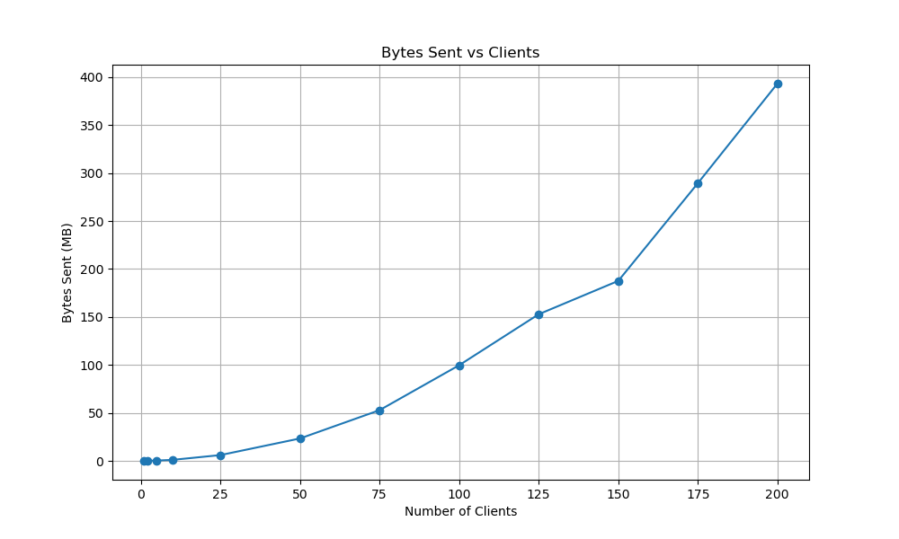
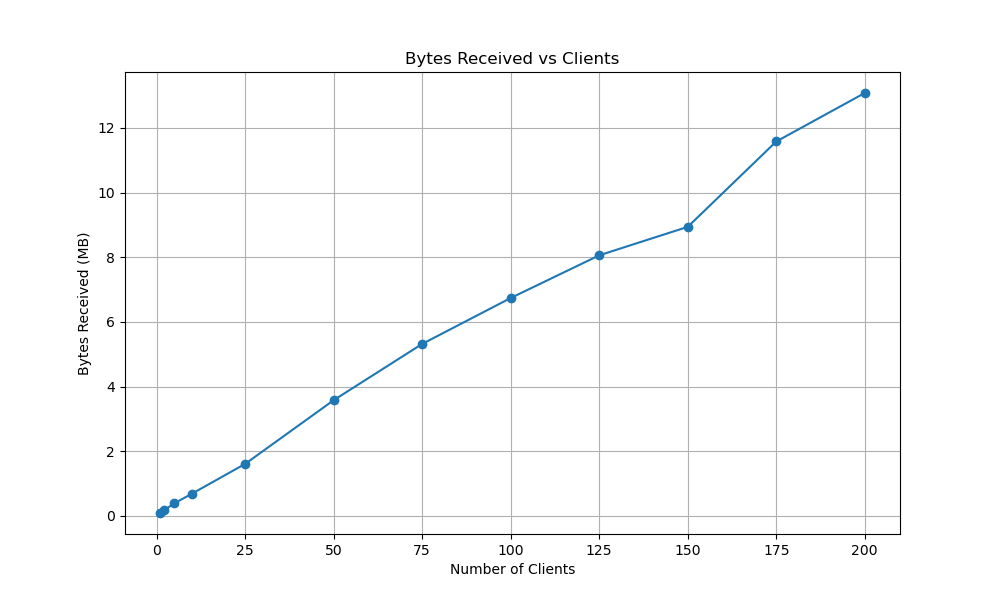
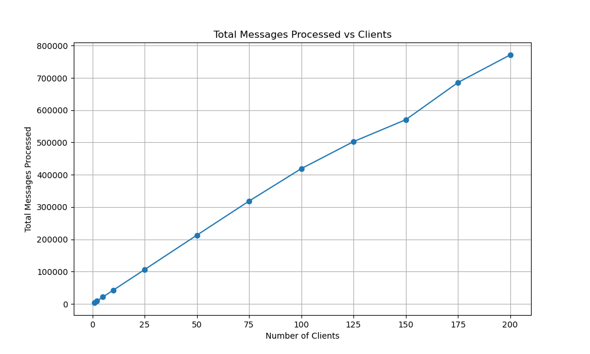

# Part 2 Analysis

## Introduction

In this analysis, we evaluate the performance of our chat server by measuring how it handles an increasing number of clients. The goal is to understand how the server scales and identify any performance bottlenecks as the client load increases.

## Experimental Setup

- **Server**: The chat server runs on a dedicated machine separate from the clients.
- **Clients**: A test client sends messages as fast as possible while also listening for incoming messages.
- **Number of Clients**: We conducted experiments with varying numbers of clients: 1, 2, 5, 10, 25, 50, 75, 100, 125, 150, 175, and 200.
- **Duration**: Each experiment ran for approximately 5 minutes (~300 seconds).
- **Metrics Collected**:
  - Total messages processed
  - Total elapsed time
  - Average messages per second
  - Average CPU usage
  - Average memory usage
  - Average bytes sent and received per interval
  - Average packets sent and received per interval
  - Average CPU frequency

## Results

### Summary of Data

| Clients | Total Messages Processed | Elapsed Time (s) | Avg Messages/sec | Avg CPU Usage (%) | Avg Memory Usage (MB) | Avg Bytes Sent per Interval (MB) | Avg Bytes Received per Interval (MB) | Avg Packets Sent per Interval | Avg Packets Received per Interval | Avg CPU Frequency (MHz) |
| ------- | ------------------------ | ---------------- | ---------------- | ----------------- | --------------------- | -------------------------------- | ------------------------------------ | ----------------------------- | --------------------------------- | ----------------------- |
| 1       | 3,721                    | 300.65           | 12.38            | 0.08              | 12.75                 | 0.02                             | 0.09                                 | 264.57                        | 1,232.43                          | 1,259.85                |
| 2       | 8,536                    | 300.90           | 28.37            | 0.10              | 12.99                 | 0.06                             | 0.17                                 | 594.80                        | 2,062.67                          | 1,446.53                |
| 5       | 21,320                   | 300.80           | 70.88            | 0.14              | 12.87                 | 0.34                             | 0.39                                 | 2,870.00                      | 5,312.53                          | 1,348.48                |
| 10      | 42,600                   | 300.72           | 141.66           | 0.21              | 12.62                 | 1.06                             | 0.69                                 | 5,726.00                      | 9,506.79                          | 1,315.99                |
| 25      | 106,375                  | 300.59           | 353.89           | 1.03              | 12.75                 | 6.03                             | 1.61                                 | 21,445.60                     | 22,329.13                         | 1,395.03                |
| 50      | 212,880                  | 301.26           | 706.64           | 3.86              | 12.75                 | 23.35                            | 3.58                                 | 66,773.80                     | 50,173.20                         | 1,361.85                |
| 75      | 318,591                  | 301.19           | 1,057.78         | 9.95              | 12.75                 | 52.85                            | 5.32                                 | 142,494.93                    | 74,580.00                         | 1,401.47                |
| 100     | 419,027                  | 300.49           | 1,394.48         | 16.25             | 12.62                 | 99.68                            | 6.74                                 | 218,646.47                    | 94,029.47                         | 1,513.21                |
| 125     | 502,758                  | 301.06           | 1,669.95         | 26.07             | 12.73                 | 152.83                           | 8.06                                 | 325,119.07                    | 111,979.67                        | 1,635.37                |
| 150     | 570,540                  | 301.26           | 1,895.90         | 34.66             | 12.87                 | 187.61                           | 8.94                                 | 385,319.07                    | 125,192.93                        | 1,577.62                |
| 175     | 685,847                  | 302.40           | 2,267.98         | 50.43             | 12.62                 | 289.43                           | 11.58                                | 588,347.87                    | 162,445.27                        | 1,486.96                |
| 200     | 771,403                  | 301.79           | 2,556.11         | 67.97             | 12.62                 | 393.30                           | 13.08                                | 738,123.93                    | 183,558.87                        | 1,546.51                |

### Graphs

#### Average Messages per Second vs. Number of Clients


#### Average CPU Usage vs. Number of Clients


#### Average Memory Usage vs. Number of Clients


#### Average CPU Frequency vs. Number of Clients


#### Bytes Sent per Interval vs. Number of Clients



#### Bytes Received per Interval vs. Number of Clients



#### Packets Sent per Interval vs. Number of Clients


#### Packets Received per Interval vs. Number of Clients


#### Total Messages Processed vs. Number of Clients



## Analysis

### Did running more clients affect the performance of your server?

Yes, running more clients significantly affected the server's performance. As the number of clients increased:

- **Average Messages per Second**: The server processed more messages per second with more clients, but the rate of increase slowed down at higher client counts. For example, doubling the clients from 100 to 200 did not double the messages per second.
- **CPU Usage**: There was a substantial increase in CPU usage, from virtually 0% with 1 client to nearly 68% with 200 clients.
- **Memory Usage**: Memory usage remained relatively constant around 12.6 MB, indicating that CPU and not memory was the bottleneck.
- **Network Traffic**: Both bytes and packets sent and received per interval increased with the number of clients, indicating higher network load.

### Anecdotally, would you say the performance degrades linearly, quadratically, factorially? Why?

Anecdotally, the performance degradation appears to be sub-linear initially but tends toward a plateau as the number of clients increases, suggesting a logarithmic trend.

- **Throughput**: The increase in average messages per second does not scale linearly with the number of clients. For instance, increasing clients from 1 to 2 more than doubles the messages per second, but increasing from 175 to 200 clients results in a smaller relative increase.
- **CPU Saturation**: The CPU usage increases significantly with more clients, suggesting that the CPU becomes a limiting factor. This non-linear increase in CPU usage contributes to the diminishing returns in throughput.
- **Conclusion**: The server's performance does not degrade quadratically or factorially; instead, it shows diminishing returns due to resource saturation, primarily CPU limitations.

### What do you conclude?

We conclude that while the server can handle an increasing number of clients, its performance does not scale proportionally. The diminishing returns in throughput and the significant increase in CPU usage indicate that the server has scalability limitations.

- **Scalability**: The server scales reasonably well up to around 100 clients. Beyond this point, the performance gains diminish, and CPU usage becomes a concern.
- **Bottlenecks**: CPU usage is the primary bottleneck as memory usage remains stable. Optimizing CPU performance could improve scalability.
- **Recommendations**: To enhance performance, we could optimize the server code for better concurrency, use more efficient algorithms, or distribute the load across multiple servers.

## Test Scripts

Below is the test script (`Script.py`) used for the experiments:

```python
# Script.py

import socket
import threading
import time

# Configuration
SERVER_IP = 'your.server.ip.address'
SERVER_PORT = 12345
NUMBER_OF_CLIENTS = N  # Replace N with the desired number of clients
MESSAGE_INTERVAL = 0  # Send messages as fast as possible
TEST_DURATION = 300  # Test duration in seconds

def client_thread(client_id):
    try:
        sock = socket.socket(socket.AF_INET, socket.SOCK_STREAM)
        sock.connect((SERVER_IP, SERVER_PORT))
        start_time = time.time()
        while time.time() - start_time < TEST_DURATION:
            message = f"Client {client_id}: Test message"
            sock.sendall(message.encode())
            response = sock.recv(1024)
            # Optional: Process server response
            time.sleep(MESSAGE_INTERVAL)
        sock.close()
    except Exception as e:
        print(f"Client {client_id} encountered an error: {e}")

# Start clients
threads = []
for i in range(NUMBER_OF_CLIENTS):
    t = threading.Thread(target=client_thread, args=(i,))
    threads.append(t)
    t.start()
    time.sleep(0.01)  # Slight delay to prevent overwhelming the server

# Wait for all clients to finish
for t in threads:
    t.join()

```
